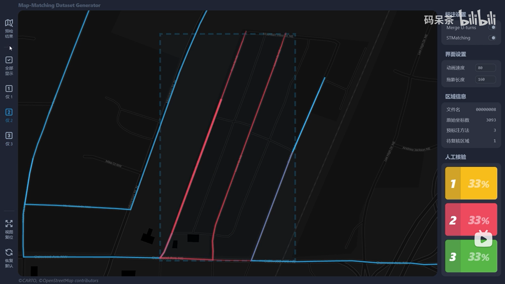
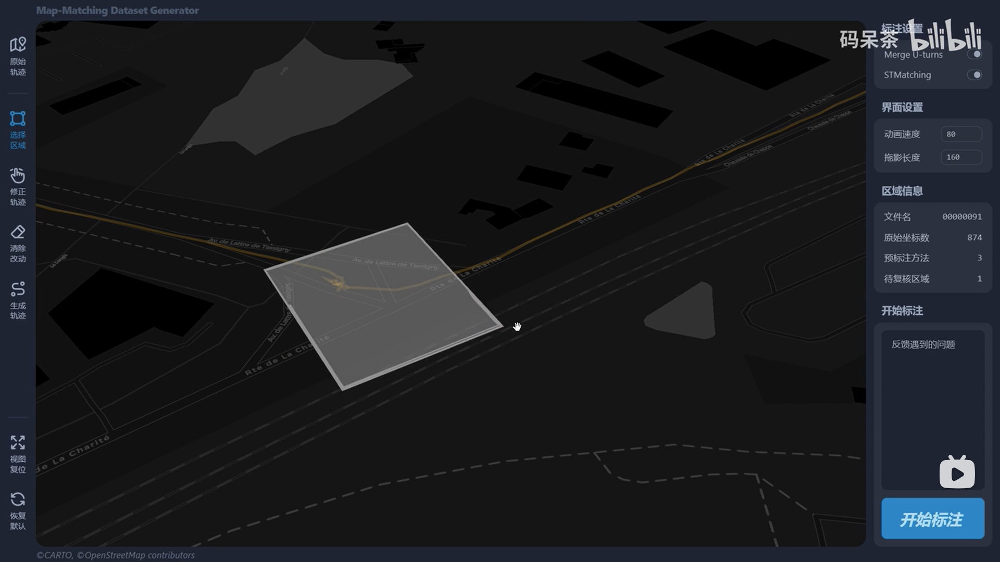
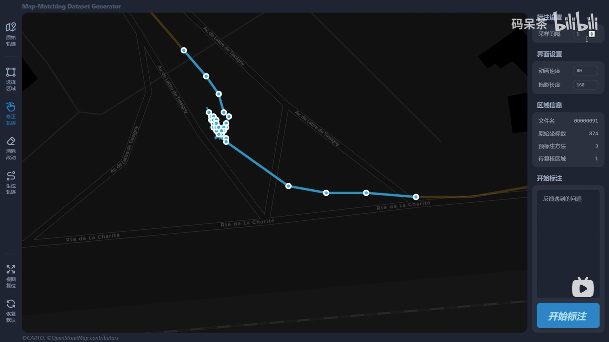

# Map-Matching Dataset Generator

## Tech Stack

- **Frontend**: React + Tailwind CSS + TypeScript
- **Backend**: Python Flask
- **Matching Algorithm**: Rust WebAssembly

## Preview

- video: [BV17A4y1o75V](https://www.bilibili.com/video/BV17A4y1o75V)
- screenshots:

## Motivation

Map matching is the foundation of many location-based applications such as navigation and trajectory data mining. Datasets used by researchers usually consist of trajectory data and road network data. There has been lots of map matching algorithms published, but most of them are evaluated on specific datasets.

It is difficult to compare different algorithms objectively. One of the reasons for this dilemma is the absence of large-scale public labeled map matching datasets, which provide correct mapping from trajectory data to road network data. However, there are no available tools for constructing large-scale labeled map matching datasets.

In view of this problem, we use the combination of algorithmic pre-labeling and manual labeling, design and implement a **map-matching dataset semi-automatic annotation tool**. The tool provides a strong support for researchers to construct labeled map matching datasets with high quality and efficiency.

The experimental results on a public labeled map matching dataset show that, our annotation tool can achieve an average labeling accuracy of 98% for same trajectory data.
